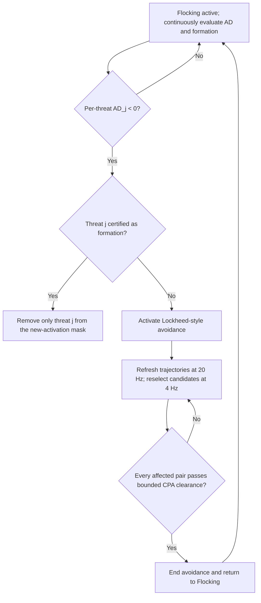

# Lockheed/Flocking Threat-Wise Integration Plan and Five-Axis Gate

## 1. Objective

Integrate the existing Lockheed-style AD/CPA path with the existing formation
discriminator so that normal formation or rejoin traffic does not cause a
nuisance activation, while an independent collision threat still activates
avoidance.

This step does **not** introduce a new collision controller. It connects the
two existing decisions in this order:



## 2. Threat-wise activation rule

For every tracked threat `j`, compute both collision margin and formation
state at the same evaluation time:

\[
AD_j=PMR_j-MASD_j
\]

\[
unsafe_j=(AD_j<0)\land(\neg formation_j)
\]

The required aggregation policy is:

```text
per_threat_exemption_only
```

A formation-classified threat is removed only from the **new activation**
mask. It cannot inhibit activation caused by a different threat.

## 3. Active-avoidance invariant

Once avoidance is active, formation discrimination cannot terminate or reset
the active episode. During the episode:

- current-state trajectories continue to refresh at 20 Hz;
- candidate combinations continue to be evaluated at 4 Hz;
- a clearly superior proposal may replace the current command only through the
  existing peer-coordination path;
- the complete AD-derived affected-threat mask is retained for termination;
- only the CPA termination test may end the episode.

## 4. Bounded CPA termination reconstruction

The public Lockheed paper directly states that current flight vectors are
projected to CPA and that the CPA distance is compared with the original
activation criterion. It also states that parallel/non-converging vectors and
a CPA behind the aircraft require special provisions, but it does not publish
their equations.

The following finite-horizon rules are therefore explicitly a **project
reconstruction**, not a claimed Lockheed implementation. Use the trajectory
horizon:

\[
T_H=4.5\ \mathrm{s}
\]

For relative position `r` and velocity `v_r`:

\[
\tau_{CPA}=-\frac{r^Tv_r}{\lVert v_r\rVert^2}
\]

Evaluate each affected pair as follows:

1. Near-zero relative speed,
   \(\lVert v_r\rVert\le\epsilon_v\): use current distance and declare the
   pair clear only when \(d_{current}>D_{activation,original}\).
2. Past CPA, \(\tau_{CPA}<0\): use current distance and the same strict
   criterion.
3. CPA within the prediction interval,
   \(0\le\tau_{CPA}\le T_H\): use \(d_{CPA}\) and declare clear only when
   \(d_{CPA}>D_{activation,original}\).
4. Future CPA beyond the prediction interval,
   \(\tau_{CPA}>T_H\): do not extrapolate beyond the validated horizon and do
   not terminate the active episode.

All affected pairs must be clear in the same evaluation before avoidance may
end. No elapsed-time termination and no post-termination rearm lockout are
added.

## 5. Calibration inputs

### 5.1 Near-zero relative-speed threshold

`epsilon_v` must be a parameter, not a hidden constant. The provisional SILS
value is derived from the final half of the normal line-flocking bag
`flocking_only_baseline_20260831_01` at 10 Hz. A first-difference estimate of
the relative-velocity measurement noise gave:

```text
component sigma [N,E,D] = [0.0084, 0.0690, 0.0048] m/s
3-D sigma              = 0.0697 m/s
3-sigma threshold      = 0.2091 m/s
```

The HILS profile may therefore use the rounded provisional value
`epsilon_v = 0.21 m/s`. This is a SILS calibration value, not a Lockheed value
and not yet a flight-qualified value.

### 5.2 Formation profile

The UAV profile must be calibrated from both:

- a labelled normal formation/rejoin bag; and
- a labelled collision-approach bag.

The profile must keep entry and exit boundaries separate and must be enabled
only in the flocking HILS configuration until the resulting confusion matrix
is reviewed. The collision approach must remain outside formation before its
first `AD < 0` activation opportunity.

### 5.3 Controller compatibility

The configured flocking target is 30 m. The runtime check must preserve:

\[
D_{flock}>D_{hard\ safety}
\]

where `D_hard safety` is the collision evaluator's physical-size, DSD, and
uncertainty budget, not DSD alone. A configuration that cannot establish this
inequality must fail validation rather than run two contradictory controllers.
At runtime, an individual formation exemption additionally requires the
pair's current 3-D separation to remain strictly above that same pair-specific
hard-safety budget. Formation classification can never mask an already
penetrated hard-safety envelope.

## 6. Minimal implementation map

Reuse without redesign:

- `ManeuverCombinationEvaluator`: per-pair PMR/MASD/AD;
- `FormationDiscriminator`: stateful range/closure classification;
- `ManeuverSelectionWorker::applyFormationActivationGate`: threat-wise mask;
- `ManeuverActivationController`: active latch and all-pair CPA termination;
- existing 20 Hz refresh, 4 Hz selection, superiority, and peer proposal path.

Required changes:

1. Add configurable `T_H` and `epsilon_v` inputs to the existing CPA
   controller.
2. Implement the four bounded-CPA cases above and add boundary tests.
3. Add an offline bag calibration report for pair range, closure, and
   relative-speed noise.
4. Add a flocking-only HILS policy profile using explicitly labelled
   provisional calibration values and `per_threat_exemption_only`.
5. Reject a flocking/formation profile whose target separation is not above
   the configured hard-safety budget.
6. Re-run focused unit tests and five-aircraft Lockheed/Flocking SILS.

## 7. Five-axis implementation checklist

| Axis | Pre-implementation status | Required PASS evidence |
|---|---|---|
| 1. Source accuracy | PASS with boundary | CPA projection, original activation criterion, formation regions, hysteresis, and new-activation inhibit cite inspected sources; horizon and numerical special cases are labelled project reconstruction. |
| 2. Interpretation fidelity | PASS | No HILS number is presented as a Lockheed value; no formation result is treated as a collision decision; `AD >= 0` is not used as termination. |
| 3. Complexity proportionality | PASS | Existing evaluator, classifier, worker, controller, transport, and selector are reused. No new ROS node, controller, or communication path is introduced. |
| 4. Implementation correctness | FAIL before change | Current CPA extrapolates without a 4.5 s bound and uses an uncalibrated `1e-6 m/s` threshold. PASS requires the four cases, strict boundary, all-pair test, parameter validation, and focused tests. |
| 5. Directional alignment | PASS | Threat-wise formation exemption gates only new AD activation; active avoidance ignores formation and ends only by CPA clearance. |

## 8. Acceptance criteria

- `AD_j < 0` plus `formation_j == true` removes only threat `j` from a new
  activation request.
- A simultaneous non-formation collision threat still activates avoidance.
- A formation-classified pair at or inside its current hard-safety budget is
  not exempted from activation.
- Formation inhibit never terminates an active episode.
- Near-zero speed and past-CPA cases use current distance.
- In-horizon CPA uses CPA distance.
- Beyond-horizon CPA cannot terminate avoidance.
- Every affected pair must pass its original activation criterion.
- Flocking HILS configuration uses `per_threat_exemption_only`, an explicitly
  provisional calibrated profile, and a compatible target/hard-safety margin.
- Unit tests, integration tests, `git diff --check`, and an independent
  five-axis re-audit all pass.

## 9. Explicit non-goals

- No CBF/Mode-B changes.
- No new trajectory predictor or maneuver selector.
- No global formation inhibit.
- No 4.5 s elapsed-time termination.
- No cooldown, rearm delay, or forced command latch.
- No claim that the project CPA special cases reproduce unpublished Lockheed
  code.

## 10. Implementation and verification record (2026-09-01)

Implemented:

- `relative_speed_epsilon_mps` and `cpa_horizon_s` are explicit validated
  parameters;
- the four bounded-CPA cases and strict original-criterion comparison are
  implemented in the existing activation controller;
- formation continues to remove only individual bits from a new-activation
  mask and cannot terminate an active episode;
- an exemption additionally requires both the configured target distance and
  current 3-D pair distance to exceed the current pair-specific activation
  criterion;
- the HILS-only v2 profile uses `per_threat_exemption_only` and the SILS-derived
  provisional `epsilon_v = 0.21 m/s`;
- the offline analyzer reports formation-gate activity separately from command
  activation.

Static verification passed: the package builds and all 19 CTests pass when the
ROS and workspace overlays are sourced. In particular, the controller boundary
tests cover near-zero speed, past CPA, in-horizon CPA, exactly-at-horizon CPA,
beyond-horizon rejection, all-affected-pair clearance, and formation/hard-
safety spacing boundaries.

Five-aircraft HILS produced two distinct results:

| Run | What was verified | Minimum 3-D separation | Result |
|---|---|---:|---|
| `lockheed_flocking_threatwise_v2_hardgate_20260901_01` | Actual 20 Hz refresh, 4 Hz exhaustive `7^5` selection, coordinated execution, threat-wise v2 gate | 9.502 m | Partial: 0.498 m below 10 m DSD for about 0.7 s |
| `lockheed_point_collision_formation_v2_hardgate_20260901_01` | Non-formation threat is not globally suppressed; commands execute | 2.684 m | Fail: collision-approach acceptance and repeated CPA exit/re-entry are not safe |

The second run also shows that v2 still classifies some point-convergence
samples as formation before the hard envelope is penetrated. The current-
distance hard gate prevents exemption *inside* the envelope, but it cannot by
itself prove that an outside-envelope encounter is a normal formation member.
Therefore v2 remains an enabled **HILS-only provisional profile** and is not a
flight-qualified or general collision-scene profile.

### Final five-axis status for this step

| Axis | Status | Evidence |
|---|---|---|
| 1. Source accuracy | PASS | Published CPA/formation statements remain separated from the labelled 4.5 s and noise-threshold project reconstruction. |
| 2. Interpretation fidelity | PASS | No v2 number or special-case equation is presented as an unpublished Lockheed value. |
| 3. Complexity proportionality | PASS | Existing evaluator, discriminator, worker, controller, messages, and HILS analyzer are reused; no new node/controller/transport was added. |
| 4. Implementation correctness | STATIC PASS / HILS FAIL | Code boundaries and tests pass, but the required collision-approach confusion-matrix/safety acceptance does not. |
| 5. Directional alignment | PASS | The implementation follows per-threat new-activation exemption, active-episode formation immunity, and all-affected-pair CPA termination. |

Promotion gate: retain v2 for explicit HILS investigation, but do not call the
integration complete until a labelled mixed scenario (normal formation peers
plus an independent intruder) passes both `minimum separation >= 10 m` and
`inhibited_while_command_active_count == 0` without hiding the intruder before
its first `AD < 0` opportunity.
